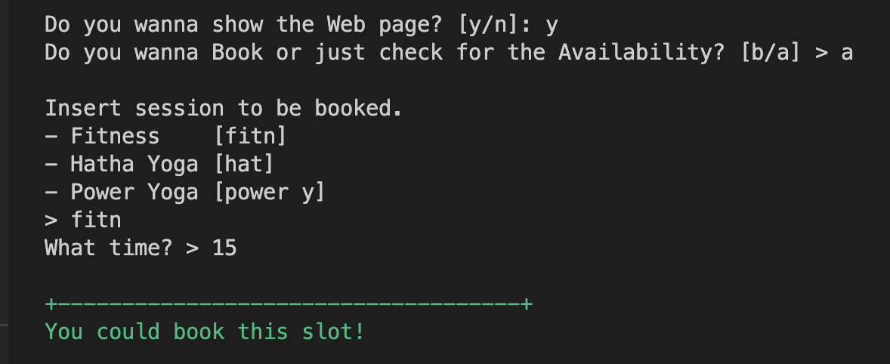
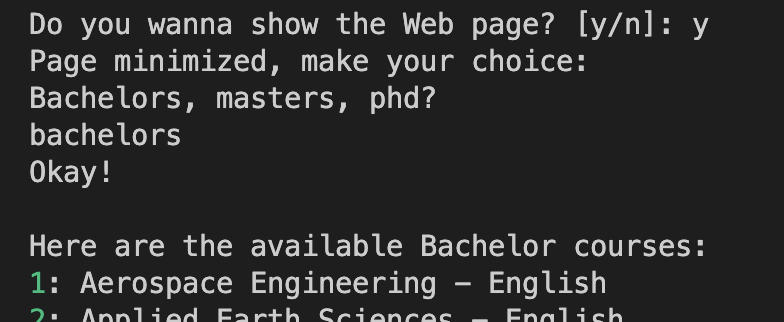

# BotNet - Web automation
This repo is intended to gather the few bots I use(d) to automate some trivial tasks. 

## Requirements:
* python **3.10.9**, albeit a version of python **3.7+** should do the job.
* Selenium Webdriver **4.8.0**, install running:
```bash
pip3 install selenium
```
* Chromium (install [here](https://chromedriver.chromium.org/downloads)): match the version you decide to download with the version you are currently using for browsing. 
To check your Chrome version:
    * open Chrome
    * at the top right, look at more
    * click Help > About Chrome 

## Install:
This repo can be downloaded locally via SSH running this line command in your terminal:
```bash
git clone git@github.com:LucaFrat/BotNet.git
```

<br />
<br />

# Gym Book bot
This Bot is useful to either book a time slot at the gym (X TU Delft) or check its availability.

## Run:
To run it from your terminal you'll have to go inside the `Gym_book_bot/` folder and run:
```bash
python3 run_gym.py
```
or directly from the root:
```bash
python3 Gym_book_bot/run_gym.py
```

## Usage:
Before being able to properly run the code you'll have to customize a couple of things:
* in `gym_book/constants.py` change the variable `CHROME_PATH` with the path to the chromium file `chromedriver.exec`
* create a file `gym_book/private.py` where to store the variables `USERNAME` and `PASSWORD` to login into the website.

be careful to set the variable `debug_mode` to `False` if you wanna insert value manually after you run the program.
Once the program has being ran, you'll be asked to insert info from the terminal: 




<br />
<br />
<br />

# Show Courses Bot
This Bot is useful to retreive and print in the terminal informations about the available Bachelor and Master courses, and about the PHD procedure, at the TU Delft.

## Run:
To run it from your terminal you'll have to go inside the `Show_courses_bot/` folder and run:
```bash
python3 run_courses.py
```
or directly from the root:
```bash
python3 Show_courses_bot/run_courses.py
```

## Usage:
Before running the code you'll have to customize a thing:
* in `show_courses/constants.py` change the variable `CHROME_PATH` with the path to the chromium file `chromedriver.exec`

Once the program has being ran, you'll be asked to insert info from the terminal:

